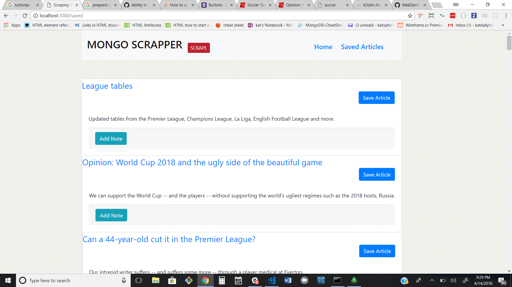

# Scrape-the-News

 
## Overview
Scrape the news is a web scraping tool.

# Utilising
* Handlebars
* Node.js
* Express
* Body-Parser
* Various Routes
* API
* Axios
* Method Override
* Cheerio
* Mongoose
* Mongo

# Using Scraper
Users can click the "Scrape" button and scrape ESPN SWoccer News! They can also make and sve notes regarding the articles they have scraped!

 This app is setup to listen on a Heroku default port.

 https://murmuring-thicket-41670.herokuapp.com/

 